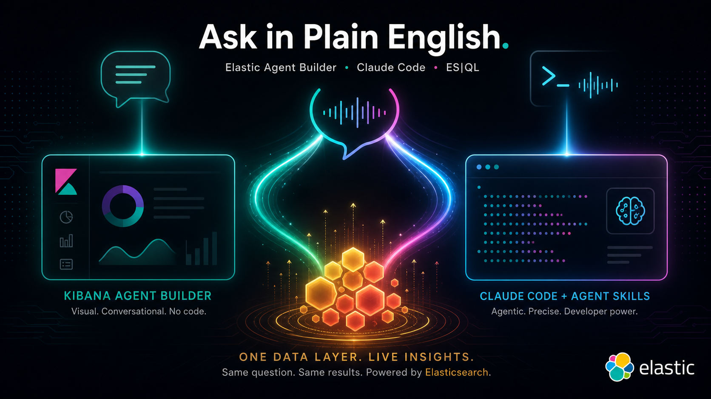
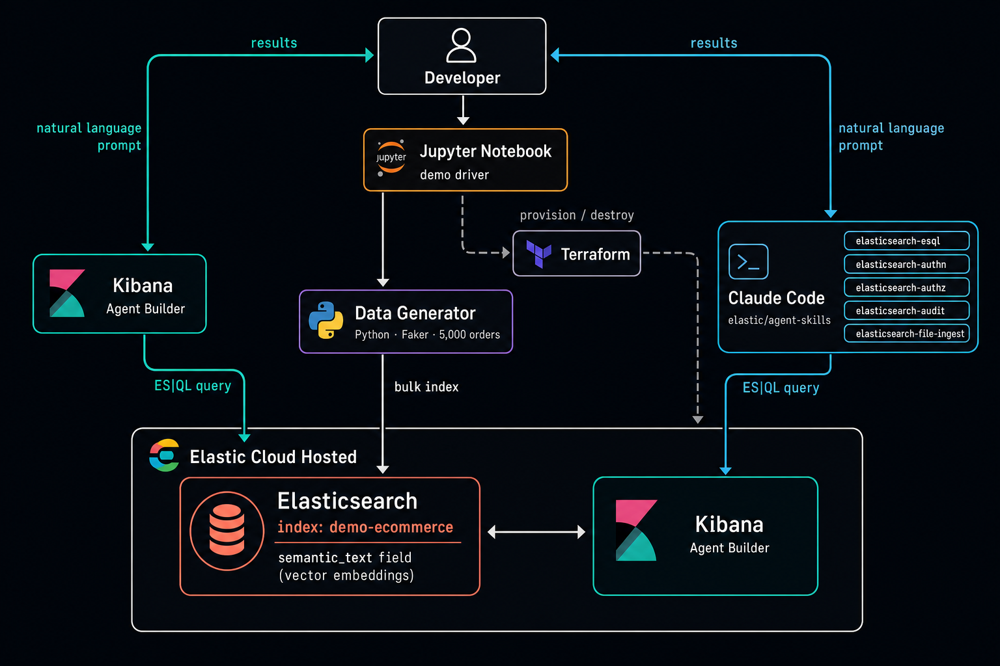
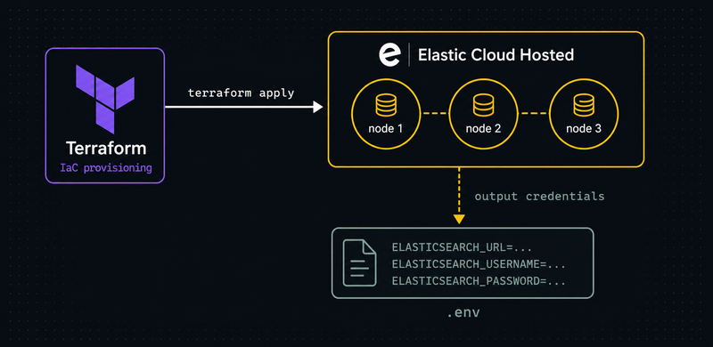
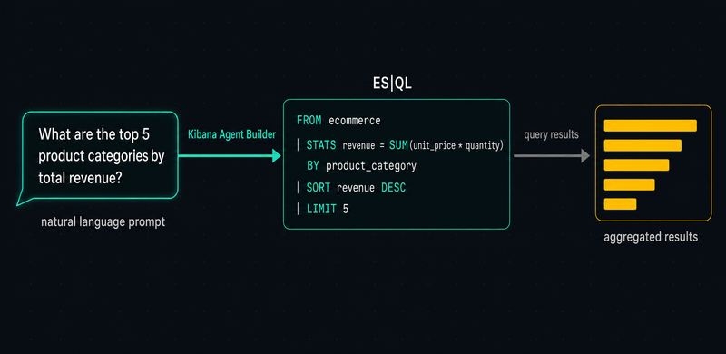
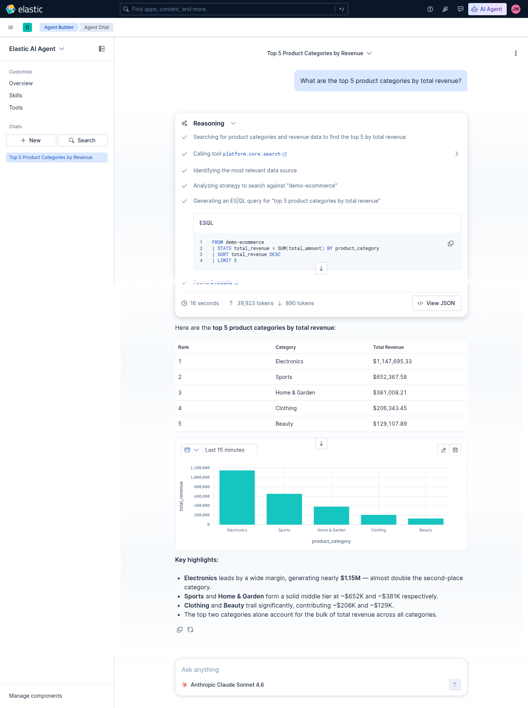
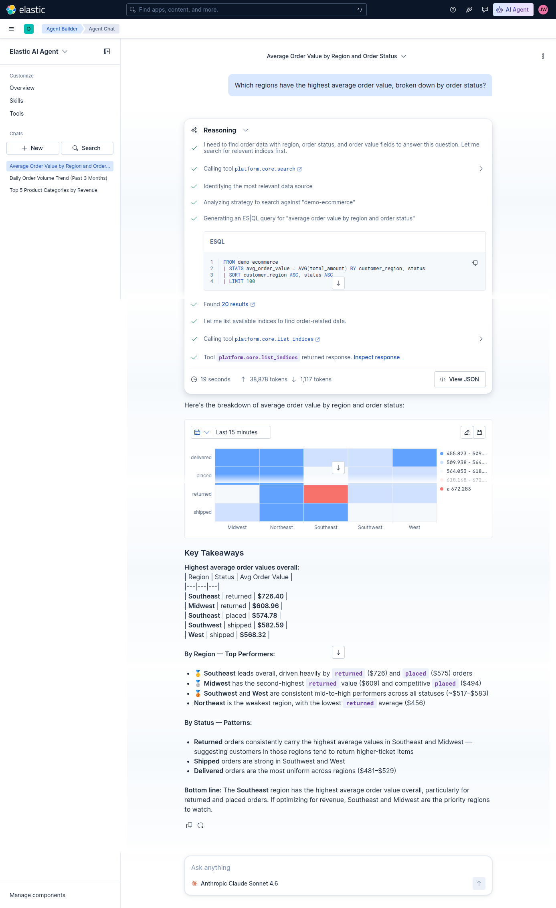
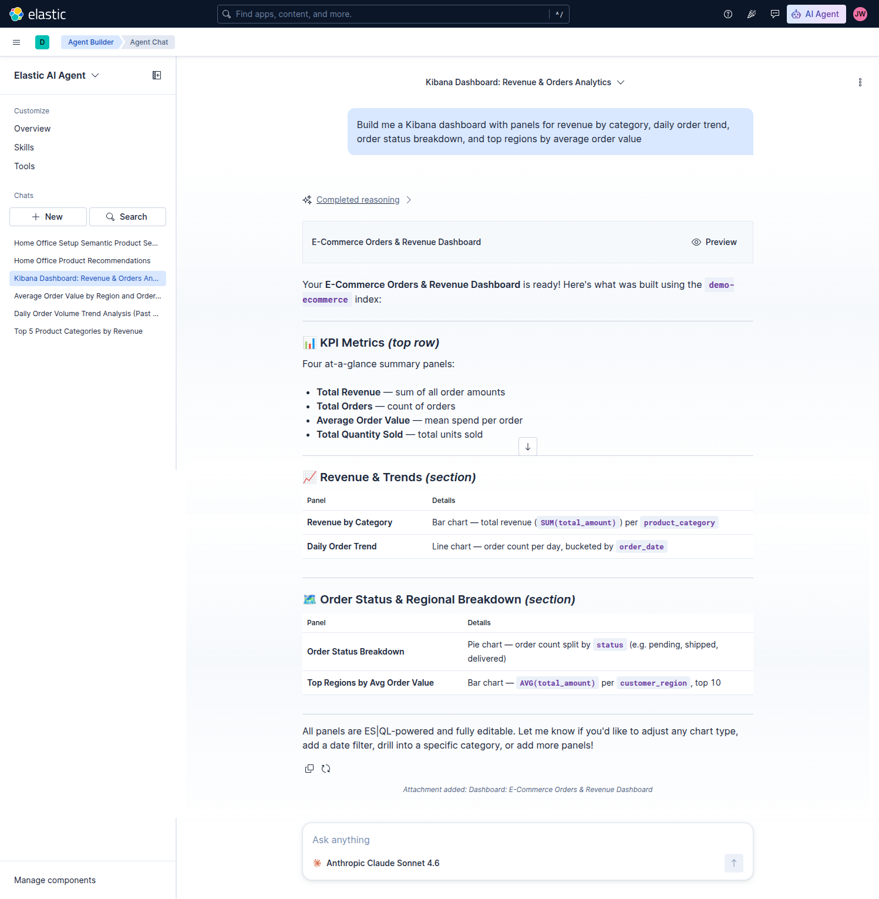
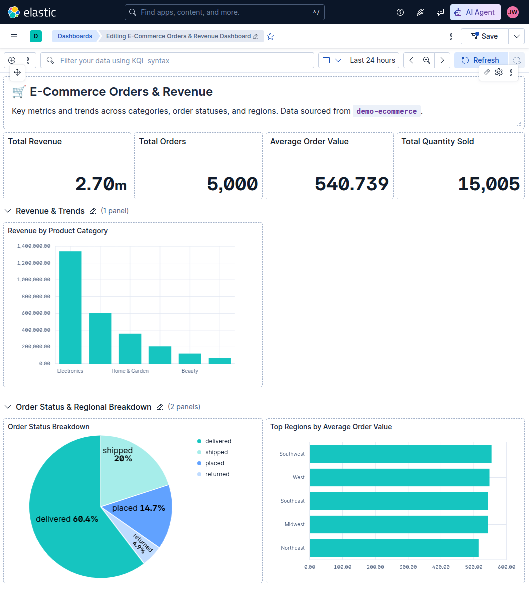
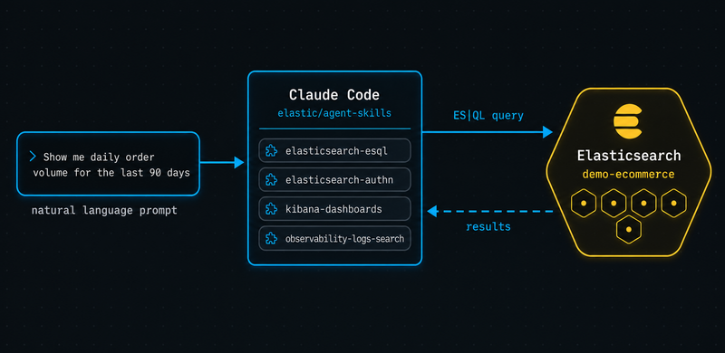

# Ask in English, Query in ES|QL: Two Ways to Talk to Elasticsearch
*Two interfaces, one Elasticsearch index: compare the Kibana Agent Builder GUI against Claude Code with Elastic agent skills — both turning plain English into live ES|QL.*

This walkthrough covers two approaches to natural-language querying of Elasticsearch: the Elastic Agent Builder in Kibana for a no-code GUI experience, and Claude Code wired with official Elastic agent skills for a developer-native CLI workflow. Both paths translate plain-English questions into ES|QL against the same live index.

---

## What This Article Covers

- Provisioning of an [Elastic Cloud](https://www.elastic.co/cloud) deployment via Terraform.
- Creation of a synthetic ecommerce orders data set and Elastic index for that set.
- Demonstration of natural language queries from the [Kibana Agent Builder](https://www.elastic.co/elasticsearch/agent-builder) interface.
- Demonstration of natural language queries from Claude Code using the [Elastic Agent Skills](https://github.com/elastic/agent-skills).

---

## Architecture


---

## Elastic Cloud Hosted (ECH) Provisioning


I use Terraform to build a 3-node ECH deployment. I store my API key in a Terraform variables file that I don't commit to GitHub. Those variables get written out to a `.env` file that's subsequently loaded via Python (`load_dotenv`).

```bash
%%bash
echo "--- Initializing ---"
terraform -chdir=terraform init -upgrade -input=false > /dev/null && echo "Done."
echo "--- Applying Changes ---"
terraform -chdir=terraform apply -auto-approve > /dev/null && echo "Done."

echo "--- Exporting Environment Variables ---"
cat > .env << EOF
ELASTICSEARCH_USERNAME=$(terraform -chdir=terraform output elasticsearch_username)
ELASTICSEARCH_PASSWORD=$(terraform -chdir=terraform output -raw elasticsearch_password)
ELASTICSEARCH_URL=$(terraform -chdir=terraform output -raw elasticsearch_url)
EOF
echo "Done."
```

---

## Agent Chat — Kibana UI


The demo notebook has five natural language query scenarios using the default Agent Chat interface in Agent Builder. I'll cover three of them here.

### Standard aggregation — top categories by revenue (STATS + SORT + LIMIT)
*"What are the top 5 product categories by total revenue?"*



### Multi-dimension grouping — regions × order status
*"Which regions have the highest average order value, broken down by order status?"*



### Dashboard generation — multi-panel Kibana dashboard built directly from a natural language request
*"Build me a Kibana dashboard with panels for revenue by category, daily order trend, order status breakdown, and top regions by average order value"*




---

## Elastic Agent Skills with Claude Code


I deploy the open-source Elastic Agent Skills with the command below and then execute a series of natural language queries with Claude Code.

```bash
echo "--- Adding Elastic Agent Skills ---"
npx skills add elastic/agent-skills --claude < /dev/null > /dev/null 2>&1 && echo "Done."

echo "--- Installed Claude Skills ---"
ls .claude/skills/ | grep -E '^(elasticsearch|kibana|observability|security|cloud)-'
```
```text
--- Adding Elastic Agent Skills ---
Done.
--- Installed Claude Skills ---
cloud-access-management
elasticsearch-audit
elasticsearch-authn
elasticsearch-authz
elasticsearch-esql
elasticsearch-file-ingest
elasticsearch-onboarding
elasticsearch-security-troubleshooting
kibana-agent-builder
kibana-alerting-rules
kibana-dashboards
... (35 skills total)
```

Three examples from the demo notebook follow.

### Filtered time-series — delivered orders over 90 days with BUCKET and date math

*"Show me daily order volume for the last 90 days, only for delivered orders"*

```bash
set -a && source .env && set +a
claude -p "Show me daily order volume for the last 90 days, only for delivered orders" \
"Show the Elastic agent skills being used, and the final answer. " \
--allowedTools Bash \
--model sonnet
```
**Results**

Here are the daily delivered order counts for the last 90 days (Mar 21 – Jun 19, 2026):

**Query used:**
```esql
FROM demo-ecommerce
| WHERE order_date >= NOW() - 90 days AND status == "delivered"
| STATS order_volume = COUNT(*) BY day = DATE_TRUNC(1 day, order_date)
| SORT day ASC
```

**Highlights:**
- **Range:** Mar 21 – Jun 19, 2026 (89 days with data)
- **Daily range:** 2–26 delivered orders/day
- **Peak day:** Jun 16 with **26 orders**
- **Low day:** Mar 21 with **2 orders** (partial first day)
- **Typical daily volume:** 14–21 orders, fairly consistent

The data shows steady delivery volume throughout the period with no dramatic spikes or drops — volume is generally stable in the 14–22 range.

### Multi-condition aggregation — return rate by category vs. overall average

*"What is the return rate for each product category, and which categories are above the overall return rate?"*

```bash
set -a && source .env && set +a
claude -p "What is the return rate for each product category, and which categories are above the overall return rate?" \
"Show the Elastic agent skills being used, and the final answer." \
--allowedTools Bash \
--model opus
```

**Results**

Here are the results. The **overall return rate is 5.26%** (263 of 5,000 orders).

#### Return rate by product category

| Product Category | Orders | Returned | Return Rate | vs. Overall (5.26%) |
|---|---|---|---|---|
| Clothing | 835 | 55 | **6.59%** | 🔺 Above |
| Books | 804 | 48 | **5.97%** | 🔺 Above |
| Electronics | 823 | 46 | **5.59%** | 🔺 Above |
| Sports | 846 | 44 | 5.20% | Below |
| Home & Garden | 834 | 38 | 4.56% | Below |
| Beauty | 858 | 32 | 3.73% | Below |

#### Categories above the overall return rate

Three categories exceed the 5.26% overall rate:
1. **Clothing — 6.59%** (highest)
2. **Books — 5.97%**
3. **Electronics — 5.59%**

Clothing stands out at ~1.3 percentage points above the overall rate, while Beauty has the lowest return rate at 3.73%.

The ES|QL query used:
```esql
FROM demo-ecommerce
| STATS total = COUNT(*), returned = COUNT(*) WHERE status == "returned" BY product_category
| EVAL return_rate_pct = ROUND(100.0 * returned / total, 2)
| SORT return_rate_pct DESC
```

### Full-text search — keyword MATCH across product descriptions

*"Find all products whose descriptions mention 'wireless' or 'bluetooth', and show total units sold and revenue for each"*

```bash
set -a && source .env && set +a
claude -p "Find all products whose descriptions mention 'wireless' or 'bluetooth', and show total units sold and revenue for each. Use a full-text MATCH search on the product_description field." \
"Show the Elastic agent skills being used, and the final answer." \
--allowedTools Bash \
--model sonnet
```

**Results**

Here are the results:

| Product Name | Total Units Sold | Total Revenue |
|---|---|---|
| Mechanical Keyboard | 33 | $12,994.47 |
| Wireless Headphones | 34 | $11,983.24 |

Two products in `demo-ecommerce` have descriptions semantically matching "wireless" or "bluetooth":

- **Mechanical Keyboard** edges out in revenue ($12,994) despite slightly fewer units — indicating a higher unit price
- **Wireless Headphones** leads in units sold (34) at $11,983 total revenue

Since `product_description` is a `semantic_text` field, `MATCH` performs vector-based semantic search rather than lexical search — which is why "Mechanical Keyboard" surfaces alongside "Wireless Headphones."

---

## Conclusion

Elasticsearch has solid out-of-the-box support for natural language queries against your indexed data. The Kibana Agent Builder is the right call when you want a quick, shareable answer without leaving the browser. Claude Code with agent skills fits better when you're already in a terminal, need the query embedded in code, or want to chain results into a larger workflow. Both paths get you to idiomatic ES|QL.

---

## Source

Full source code on [GitHub](https://github.com/joeywhelan/agent-chat).

---